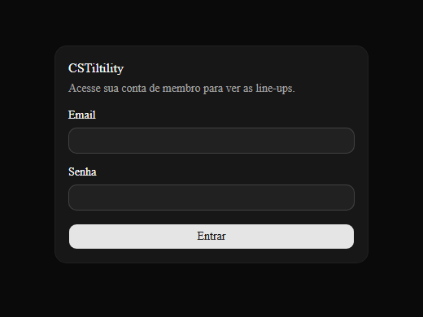

# CSTiltility


Plataforma de membros premium para ensinar line-ups de CS2 (smokes, flashes e HEs) mapa por mapa, com uma experiência de navegação estilo Netflix e acabamento visual inspirado na Apple.

## Screenshot



## Status

**MVP sem cobrança.** O acesso é liberado manualmente pelo admin — não há checkout implementado ainda. A camada de acesso foi projetada para plugar um provedor de pagamento (ex: Stripe) depois, sem refatoração grande.

## Stack

- [Next.js](https://nextjs.org) (App Router) + TypeScript em modo estrito
- Tailwind CSS + [shadcn/ui](https://ui.shadcn.com)
- [Supabase](https://supabase.com): Postgres, Auth e Storage
- Deploy: Vercel
- Vídeo: embed do YouTube via iframe

## Estrutura de conteúdo

```
Course (Mapa: Mirage, Inferno, Dust2...)
  └─ Module (tipo de granada: smoke | flash | he | molotov)
       └─ Lesson (line-up específica)
```

Cada aula tem vídeo do YouTube, descrição/dificuldade e um campo de notas do aluno com autosave.

## Papéis de usuário

- **admin**: CRUD de conteúdo, gestão de membros e do banner da home
- **member**: acesso à área de membros, aulas liberadas, notas e progresso

Controle de acesso via Row Level Security (RLS) no Supabase, não apenas na UI. Rotas `/admin/*` protegidas por middleware.

## Rodando localmente

```bash
npm install
npm run dev
```

Copie `.env.local.example` para `.env.local` e preencha as credenciais do Supabase antes de rodar.

Abra [http://localhost:3000](http://localhost:3000).

## Comandos

- `npm run dev` — ambiente local
- `npm run build` — build de produção
- `npm run lint` — checagem de lint

## O que não está implementado (de propósito)

- Checkout/pagamento
- Quiz builder
- Upload/hospedagem própria de vídeo

Mais detalhes de convenções e modelo de dados em [CLAUDE.md](./CLAUDE.md).
